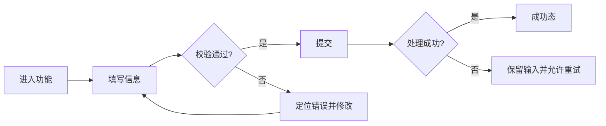
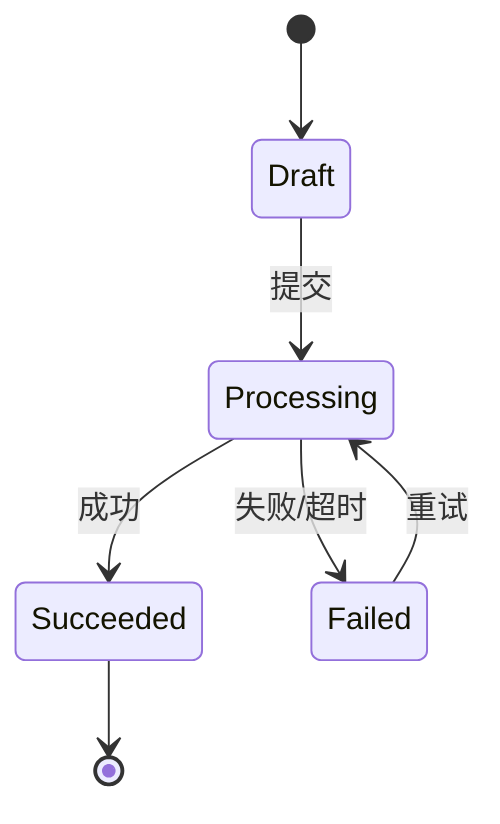
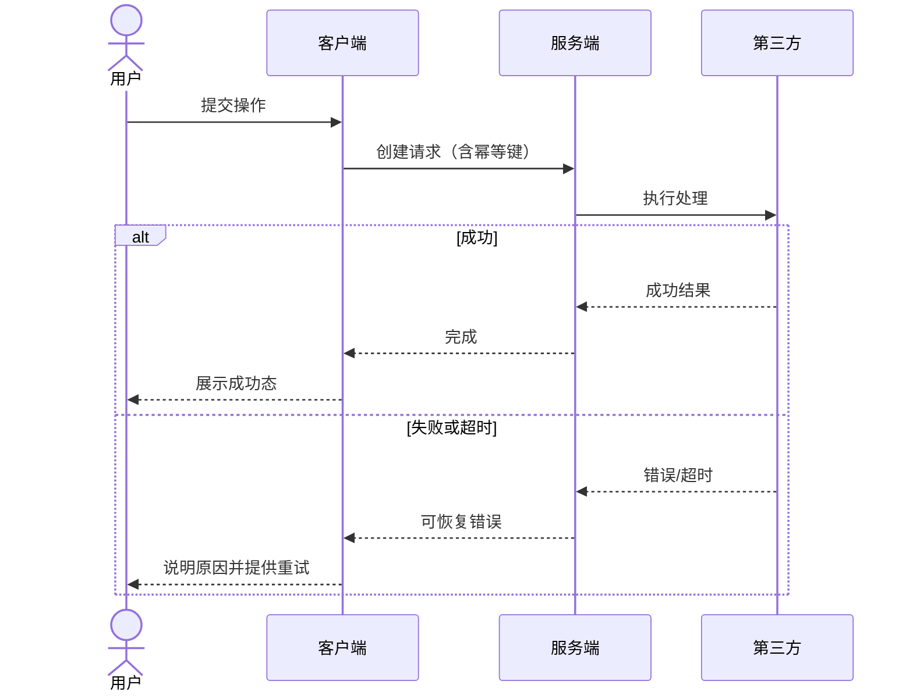
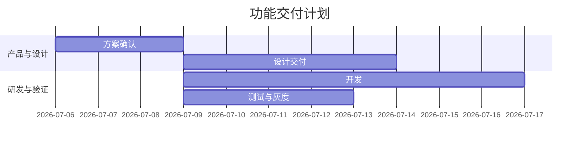

# 产品图表示例

这里仅提供产品语义与语法示例。图型、事实核对、模板选择、排版、渲染和检查规则由 [结构化图表](../../product-team-diagrams/SKILL.md) 统一维护。示例中的能力、系统、日期和数值均是假设，不是当前产品事实或排期承诺；只复用表达方式，不复制业务规则。

## 1. 用户流程与决策树

用于入口、主路径、条件分支、失败恢复。




## 2. 状态机

用于订单、审批、任务、账号、内容发布等生命周期。




## 3. 系统时序

用于客户端、服务端、异步任务和第三方系统协作。




## 4. 计划与里程碑

仅在用户需要排期或存在阶段依赖时使用。




## 5. 数据图表

只在有真实数值时使用。趋势用折线，分类比较用柱状；样本很少或需要精确读取时用表格。

```mermaid
xychart-beta
    title "指标趋势"
    x-axis [阶段1, 阶段2, 阶段3]
    y-axis "指标值" 0 --> 100
    line [20, 45, 70]
```

## 6. 汇报问题与表达选择

| 需要解释的产品问题 | 可考虑的表达 |
| --- | --- |
| 现状如何演进为目标 | 前后对比、迁移路径 |
| 多入口如何统一 | 入口收敛图 |
| 分阶段交付有哪些依赖 | 时间线、计划与里程碑 |
| 多方如何协作 | 泳道或责任矩阵 |
| 不同资源适用哪些规则 | 规则矩阵 |
